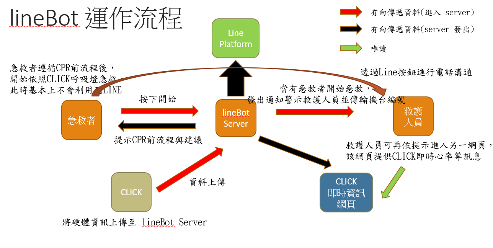
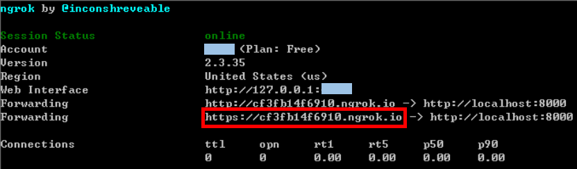
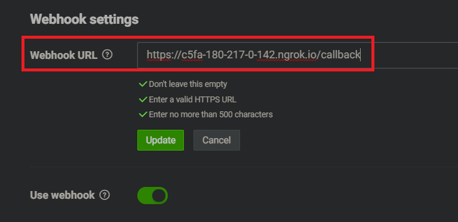

# lineBot_Server

此 Repository 負責 Click 一切與 LineBot 相關的服務

Click 硬體端 Repository： https://github.com/jimmylin0979/Click-Hardware.git

當前 Heroku 部署網址：https://click-server-on-heroku.herokuapp.com/

# 目錄

-   [工作流程](#workflow)
-   [以 Ngrok 部署 Server](#ngrok)
-   [以 Heroku 部署 Server](#heroku)
    -   [Server 運作程式修改](#overview)
    -   [Repository 必備文件](#prerequisite)

<h1 id="workflow">工作流程r</h1>



---

<h1 id="ngrok">以 Ngrok 部署 Server</h1>

-   優：部署簡單，用來做系統測試很方便
-   劣：電腦、網路必須常駐開啟；每次重開 Server 時網址皆會變化

1. 執行 `$python3 app.py`，以 Flask 架設伺服器
2. 另外開一個 cmd，以 Ngrok 將內網 5000 port 與外網串接起來
    ```bash
        $ cd Ngrok
        # (以 windows 作業系統為例)，若為 mac/linux，請以 ./ngrok 作為命令開頭
        $ ngrok.exe http 5000
    ```
    
3. 進入 [line Developers](https://developers.line.biz/en/) 網站，將 webhook URL 更新為當前串接之外網網址 (上一部獲得之網址)
   
4. lineBot Server 建設完成

---

<h1 id="heroku">以 Heroku 部署 Server</h1>

-   優：電腦、網路無須常駐開啟，網址固定不會變動
-   劣：免費版會休眠，長時間未用時再啟用會花費約 10s 喚醒時間；

目前部署的主要方式，詳情請看 LineBot_Server 資料夾 README

首先進入 [line Developers](https://developers.line.biz/en/) 網站，將 webhook URL 更新為當前部署網址

部署網址：https://click-server-on-heroku.herokuapp.com/

<h2 id="overview">Server 運作程式修改</h2>

請先向管理員獲取更改權限，否則更改將無法 Push 成功!!

`預設有新歷史更新至 master 分支時，Heroku 皆會重新 Build Server，耗時約莫 1min 左右`

### 1. 提交 Git Commit 並部署到 Heroku

```bash
# 提交修改，進入歷史
$ git add .
$ git commit

# 更新至遠端 master 分支
# PUSH 完之後應該會跑一大串，慢慢等吧~
$ git push -u origin master               # 提交到远程master分支
```

#

<h2 id="prerequisite">Repository 必備文件</h2>

以下為應在 lineBot_Server 根目錄下 Git Repository 內具備的文件，這些文件多用來向 Heroku 描述程式、定義程式入口、啟動等的宣告檔。

最基本的目錄排列應如下：

```
folder/
  ├ .gitignore
  ├ app.json
  ├ Procfile
  ├ README.md
  ├ requirements.txt
  └ run.py
```

-   app.json：用來描述 這項應用的 細節，包括 name, repository 等等。

    repository 務必要與 heroku 上登記的一樣，其他無所謂 XD

    ```json
    {
        "name": "Click Server on Heroku",
        "description": "Click LineBot server that deploys on Heroku",
        "image": "heroku/python",
        "repository": "https://git.heroku.com/click-server-on-heroku.git",
        "keywords": ["python", "flask"]
    }
    ```

-   requirements.txt：Python 檔案運行所需的標題庫

    將依賴標題庫都輸入

    因为我们不能靠 Flask 自带的 Web 服务器来运行 Flask 程序，所以 gunicorn 是个很好的选择。

    ```bash
    Flask==0.10.1
    gunicorn==19.4.5
    ```

-   Procfile：告訴 Heroku 要如何啟動這個程式來開始運作

    `-log-file -`是为了让日志打印到标准输出 stdout 上，因为 Heroku 不提供撰寫本地磁盘的功能。

    ```bash
    # 以 gunicorn 代為起動 程式
    # <pyfile> 請更改為 主啟動py檔，僅需要 檔名不 需副檔名
    # 如果程式啟動為 main.py，則應為 web: gunicorn main:app --log-file -
    web: gunicorn <pyfile>:app --log-file -
    ```
